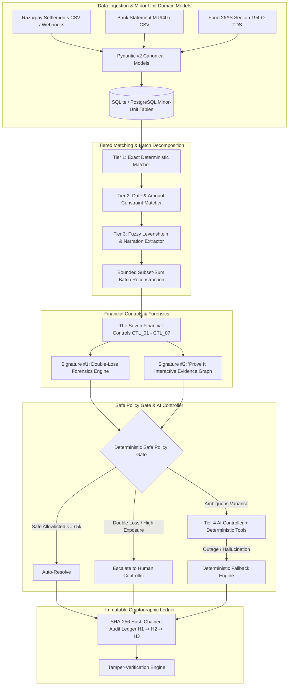

# HISAB Technical Architecture & System Design

**HISAB** (*Hindi: हिसाब* — *Account / Ledger Reconciliation*) is a production-grade Autonomous Finance Controller engineered for Indian merchants operating on payment gateways (e.g. Razorpay) and banking rails (NEFT / RTGS / IMPS).

---

## 1. High-Level System Architecture

---

## 2. The Four-Tier Matching Ladder

HISAB resolves financial touchpoints through a tiered matching strategy:

1. **Tier 1 — Exact Deterministic Matcher (`packages/matching/exact_matcher.py`)**:
   - Matches unique commercial primary keys (`order_id`, `payment_id`, `refund_id`, `dispute_id`, and exact `utr` references) with 100% confidence.
2. **Tier 2 — Constraint-Based Matcher (`packages/matching/constraint_matcher.py`)**:
   - Matches records using capture-to-settlement time windows ($T \text{ to } T+3\text{ days}$) and fee-adjusted minor-unit net amounts in paise.
3. **Tier 3 — Fuzzy String & Narration Matcher (`packages/matching/constraint_matcher.py`)**:
   - Extracts candidate settlement IDs from unformatted bank narrations (`CMS/RAZORPAY/SETL_8842/...`) and computes Levenshtein distance on altered bank references (`UTR778211000_MOD`).
4. **Batch Decomposition & Subset-Sum Reconstruction (`packages/matching/batch_decomposition.py`)**:
   - Reconstructs unmapped transactions in corrupted feeds by solving a bounded subset-sum optimization to match the exact gross deficit of settlement batches.

---

## 3. The Seven Financial Controls

| Control ID | Name | Financial Assertion | Severity Rule |
| :--- | :--- | :--- | :--- |
| **`CTL_01_SETTLEMENT_BANK`** | Settlement-to-Bank Mismatch | Accuracy | Fails on UTR mismatch or payout variance |
| **`CTL_02_MISSING_TXN`** | Missing Settlement Transaction | Completeness | Identifies unlinked captured payments |
| **`CTL_03_DUPLICATE`** | Duplicate Captured Payment / Refund | Occurrence | Flags multiple captures on identical orders |
| **`CTL_04_FEE_GST`** | Fee / GST Inconsistency | Classification | Validates 2% MDR & 18% GST against schedules |
| **`CTL_05_REFUND`** | Refund Correctness & Non-Reversal | Measurement | Validates non-reversed MDR retention on refunds |
| **`CTL_06_DOUBLE_LOSS`** | **Potential Double-Loss Outflow Risk** | Compounded Outflow | **CRITICAL**: Flags concurrent refund + dispute |
| **`CTL_07_DISPUTE`** | Dispute Exposure & Deadline Tracking | Cut-off & Exposure | Flags approaching representment deadlines ($\le 48\text{h}$) |

---

## 4. Cryptographic Non-Repudiation ($H_1 \to H_2 \to \dots$)

Every material transaction, match, policy decision, and escalation is cryptographically sealed in the audit ledger:

$$\text{Entry Hash} = \text{SHA-256}(\text{prev\_hash} \parallel \text{seq} \parallel \text{batch\_id} \parallel \text{case\_id} \parallel \text{event\_type} \parallel \text{action} \parallel \text{policy\_result} \parallel \text{payload\_json} \parallel \text{iso\_timestamp})$$

- **Genesis Hash ($H_0$):** `0000000000000000000000000000000000000000000000000000000000000000`
- **Tamper Detection:** If any historical field is altered in the database, the hash verification immediately fails with the exact sequence number and discrepancy.

---

## 5. Technology Stack

- **Backend:** Python 3.12, FastAPI, SQLAlchemy 2.0, Pydantic v2, Pytest.
- **Frontend:** Next.js 14 (App Router), React 18, Tailwind CSS, Lucide Icons.
- **Data & Arithmetic:** Minor-unit integer paise math with symmetric half-up rounding.
