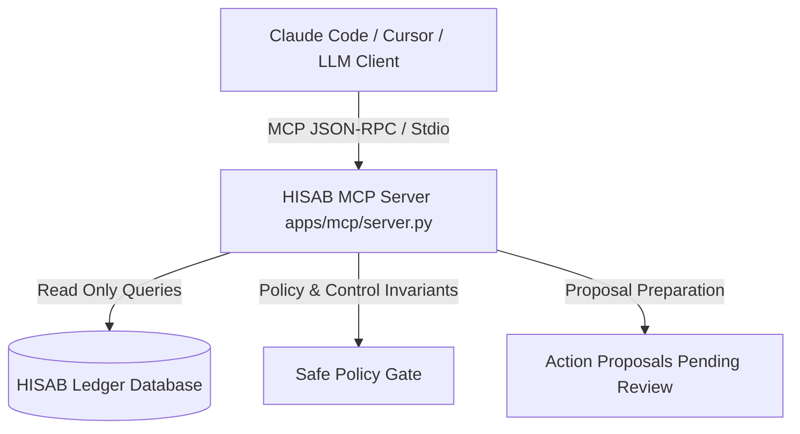

# HISAB Model Context Protocol (MCP) Server Guide

This document describes how to connect **HISAB MCP Server** to **Claude Code**, Cursor, or any MCP-compliant client.

The HISAB MCP Server exposes real, PostgreSQL/SQLite-grounded financial state, controls, forensic double-loss analysis, snapshots, and audit trails without exposing arbitrary SQL or bypassing safe policy gates.

---

## 1. Architecture & Security Invariants



### Safety Principles:
1. **Zero Raw SQL Injection:** Queries run through predefined, typed repository functions.
2. **Structured Evidence Grounding:** All financial responses contain explicit `evidence_ids`.
3. **Controlled Action Proposals:** Material mutations (e.g. resolving double-loss, closing batches) produce structured proposals (`prepare_resolution`, `prepare_batch_close`) that require explicit human controller authorization in the dashboard.

---

## 2. Configuration for Claude Code

Add the following to your `claude.json` or `.claude/config.json`:

```json
{
  "mcpServers": {
    "hisab": {
      "command": "/home/shubh/Desktop/code/buildathon/.venv/bin/python",
      "args": ["/home/shubh/Desktop/code/buildathon/apps/mcp/server.py"],
      "env": {
        "PYTHONPATH": "/home/shubh/Desktop/code/buildathon"
      }
    }
  }
}
```

---

## 3. Available MCP Tools

### Read Tools (Grounded Inquiries)

| Tool Name | Parameters | Description |
| :--- | :--- | :--- |
| `get_batch_status` | `batch_id: str` | Returns turnover, match rate, open exceptions, and unresolved exposure |
| `list_exceptions` | `status: str`, `severity: str` | Lists all detected financial exceptions with categories and impacts |
| `get_exception_evidence` | `exception_id: str` | Retrieves the full evidence dossier behind a specific exception |
| `find_potential_double_losses` | None | Forensically detects concurrent refund and chargeback dispute events |
| `trace_payment` | `payment_id: str` | Returns multi-touchpoint graph: Order → Payment → Settlement → Bank |
| `compare_snapshots_tool` | `snapshot_id_a: str`, `snapshot_id_b: str` | 'What Changed?' diff comparator between two immutable snapshots |
| `get_control_results` | `batch_id: str` | Returns evaluation status across all Seven Financial Controls (`CTL_01`–`CTL_07`) |
| `get_audit_trail` | `case_id: str`, `limit: int` | Returns SHA-256 hash-chained cryptographic audit log entries |

### Action Proposal Tools (Requires Human Sign-off)

| Tool Name | Parameters | Description |
| :--- | :--- | :--- |
| `prepare_resolution` | `exception_id: str`, `justification: str` | Prepares a safe resolution proposal (blocks forbidden categories) |
| `prepare_batch_close` | `batch_id: str` | Evaluates 7 controls and generates a batch closure authorization proposal |

---

## 4. Example Prompts in Claude Code

### Prompt 1: Why can't the batch close?
> *"Why can't Batch #1842 close?"*

**Claude Code invokes:**
`get_batch_status(batch_id="BATCH_AUG_2026")` → `list_exceptions(status="OPEN")` → `get_exception_evidence("EX-10006")`

**Response:**
> "Batch #1842 cannot close because 8 material exceptions remain unresolved representing ₹1,44,500.00 in exposure. The primary blocker is **EX-10006** (Compounded Double-Loss on Order `order_10006`), which violates policy rule `POLICY_FORBIDDEN_CATEGORY` and requires human representment filing."

---

### Prompt 2: Trace payment flow
> *"Trace payment pay_90006 and explain why it's flagged."*

**Claude Code invokes:**
`trace_payment(payment_id="pay_90006")`

**Response:**
> "Payment `pay_90006` (₹72,000.00) captured via RuPay card on 01 Aug 2026 received a manual customer refund `rfnd_3026` (-₹72,000.00) on 02 Aug 2026, and an independent bank chargeback dispute `disp_dbl_pay_90006` (-₹72,500.00) on 02 Aug 2026. The merchant is currently at a net deficit of -₹72,500.00."
